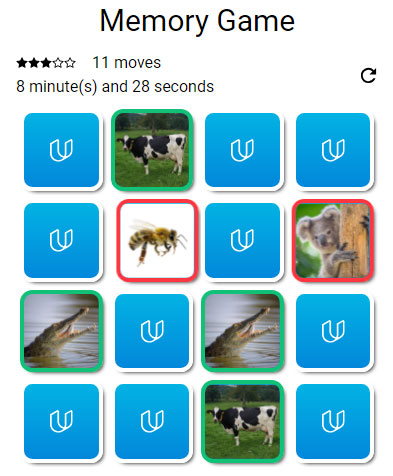

# memory-game
A memory game as part of the Udacity JS formation.

##How to open the game
This game is meant to play online, on a simple browser.
You don't have to install anything. Just launch the index.html file in your favorite browser, or go to https://ralf5543.github.io/memory-game/

##How to play
The game starts as soon as you refresh the page, but you can relaunch it anytime by clicking the reset button.

The goal is, as the original one, to reveal all cards.
Each turn, you chose 2 cards to be revealed. If they are identical, they stay visible. Else, they are flipped again.
The fewer attemps you'll make, the more stars you'll earn.

The stopwatch is just there to motivate you !

##Dependencies
If you want to modify it, you will need :
* gulp
* gulp-sass
* gulp-autoprefixer
* gulp-responsive

You can install them simply with
```
$ npm install
```

